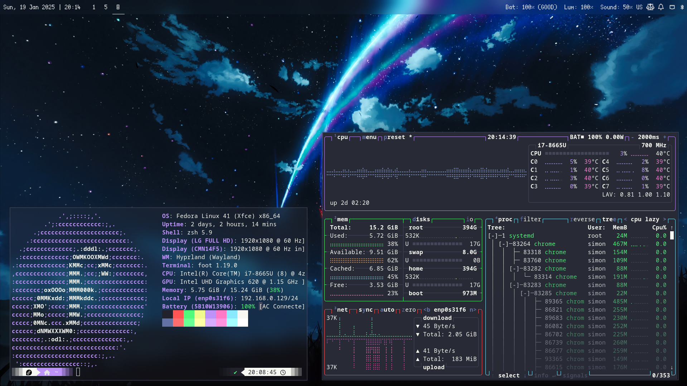

# 🐧 Dotfiles for Fedora + Hyperland

## Preview

  

## Disclaimer
This setup is made for me but if you are new to Fedora/Hyprland/Ricing, you still may find interesting stuff. Open an issue if you have any question :)

## Main features
- Theme : When available, [Dracula](https://draculatheme.com/) theme is used.
- Terminal : Foot
- Keyboard : Configured for US International (with accentued characters)
